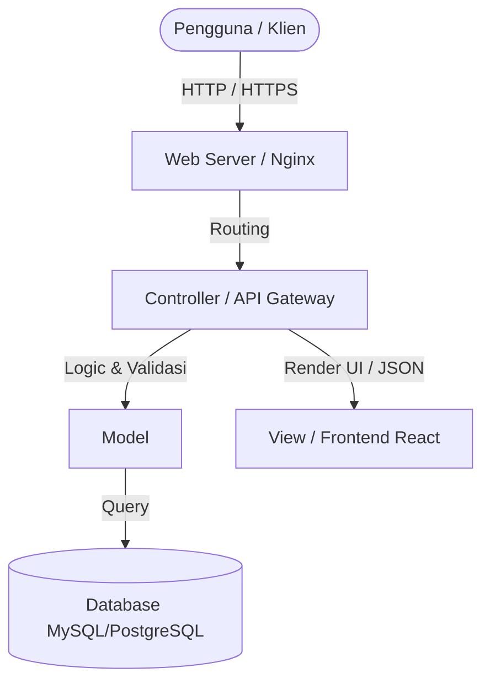
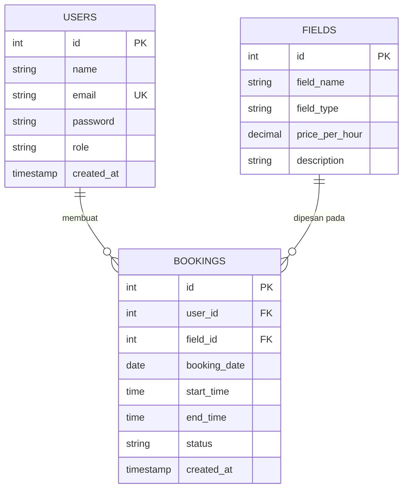

# Software Design Documentation (SDD)
## Dokumentasi Desain Perangkat Lunak (DPL)

**Nama Proyek:** [Nama Proyek Anda]  
**Versi:** 1.0  
**Tanggal:** 23 Juni 2026  
**Status:** Draft  

---

## 1. Pendahuluan

### 1.1 Tujuan
Tujuan dari dokumen Desain Perangkat Lunak (SDD) ini adalah untuk memetakan kebutuhan-kebutuhan yang didefinisikan dalam dokumen *Software Requirement Specification* (SRS) ke dalam arsitektur teknis, desain database, struktur komponen, dan desain antarmuka perangkat lunak sebelum fase pengembangan (coding) dimulai.

### 1.2 Ruang Lingkup (Scope)
Desain ini mencakup arsitektur backend, skema basis data, desain antarmuka frontend, dan mekanisme keamanan sistem untuk [Nama Aplikasi/Sistem].

### 1.3 Referensi
*   IEEE Std 1016-2009, *IEEE Standard for Information Technology—Systems Design—Software Design Descriptions*.
*   Spesifikasi Kebutuhan Perangkat Lunak (SRS) [Nama Proyek Anda] Versi 1.0.

---

## 2. Desain Arsitektur Sistem

### 2.1 Arsitektur Tingkat Tinggi (High-Level Architecture)
Sistem ini menggunakan arsitektur **Client-Server** dengan pola desain **MVC (Model-View-Controller)** atau **Separated Frontend-Backend (API-driven)**.



### 2.2 Deskripsi Komponen Arsitektur
1.  **Client Layer (Presentation):** Bertanggung jawab untuk menyajikan antarmuka pengguna grafis (GUI) dan menangani interaksi langsung pengguna. Dibangun menggunakan [React / Vue / HTML CSS JS vanilla].
2.  **Application Layer (Controller/Logic):** Berfungsi mengolah logika bisnis, validasi masukan dari klien, dan memproses permintaan sebelum dikirim ke database.
3.  **Data Layer (Model/Persistence):** Menyimpan data sistem secara persisten dan memetakan struktur data relasional.

---

## 3. Desain Data & Database

### 3.1 Entity Relationship Diagram (ERD)
Berikut adalah rancangan hubungan entitas (ERD) untuk sistem ini:



### 3.2 Kamus Data / Skema Tabel

#### Tabel: `users`
| Nama Kolom | Tipe Data | Atribut | Deskripsi |
| :--- | :--- | :--- | :--- |
| `id` | INT | PK, Auto Increment | ID unik pengguna |
| `name` | VARCHAR(100) | Not Null | Nama lengkap pengguna |
| `email` | VARCHAR(100) | Unique, Not Null | Alamat email (untuk login) |
| `password` | VARCHAR(255) | Not Null | Kata sandi terenkripsi (hash) |
| `role` | VARCHAR(20) | Default: 'user' | Peran pengguna ('admin', 'user') |
| `created_at` | TIMESTAMP | Nullable | Waktu pembuatan akun |

#### Tabel: `bookings`
| Nama Kolom | Tipe Data | Atribut | Deskripsi |
| :--- | :--- | :--- | :--- |
| `id` | INT | PK, Auto Increment | ID unik pemesanan |
| `user_id` | INT | FK -> `users.id` | ID pengguna yang memesan |
| `field_id` | INT | FK -> `fields.id` | ID lapangan yang dipesan |
| `booking_date`| DATE | Not Null | Tanggal pemesanan lapangan |
| `start_time` | TIME | Not Null | Waktu mulai sewa |
| `end_time` | TIME | Not Null | Waktu selesai sewa |
| `status` | VARCHAR(20) | Default: 'pending'| Status pemesanan ('pending', 'approved', 'rejected') |

---

## 4. Desain Antarmuka Pengguna (User Interface Design)

### 4.1 Peta Situs (Sitemap) / Alur Navigasi
```text
[Landing Page]
   ├── [Registrasi / Login]
   │         └── [Dashboard Pengguna]
   │                   ├── [Cari Lapangan]
   │                   ├── [Form Booking]
   │                   └── [Riwayat Booking]
   └── [Dashboard Admin]
             ├── [Kelola Lapangan]
             ├── [Kelola Transaksi / Approval]
             └── [Laporan Booking]
```

### 4.2 Rancangan Antarmuka Utama (Wireframe)
*   **Halaman Utama:** Menampilkan header dengan logo, tombol login/register, daftar lapangan olahraga yang tersedia, dan footer.
*   **Form Pemesanan:** Menyediakan pilihan tanggal (datepicker), pilihan jam mulai dan selesai, serta tombol "Pesan Sekarang".

---

## 5. Desain Keamanan dan Kontrol

1.  **Autentikasi:** Menggunakan session-based authentication untuk aplikasi monolitik, atau JSON Web Token (JWT) untuk aplikasi terpisah (SPA/Mobile).
2.  **Otorisasi (Role-Based Access Control - RBAC):** Pembatasan akses route/halaman berdasarkan kolom `role` pengguna. Akses rute `/admin/*` hanya diperbolehkan jika role bernilai 'admin'.
3.  **Proteksi Input:** Menggunakan ORM (Object-Relational Mapping) untuk mencegah SQL Injection, dan sanitasi input untuk mencegah XSS.
