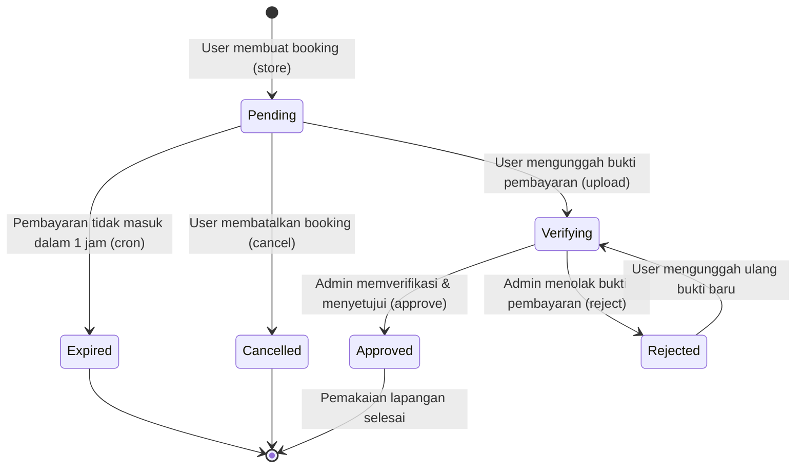

# Behaviour Testing (Pengujian Perilaku & Transisi Status)

Dokumen ini mendokumentasikan skenario pengujian perilaku (*Behaviour Testing*) untuk melacak perubahan status pemesanan lapangan olahraga pada database sistem [Website-BookingLapangan](https://github.com/JarJel/Website-BookingLapangan). Pengujian berfokus pada siklus hidup data booking dari pembuatan transaksi awal hingga status akhir.

---

## 1. Diagram Transisi Status Booking (Mermaid)

Siklus hidup status transaksi pada kolom `bookings.status` digambarkan sebagai berikut:

---

## 2. Tabel Transisi Status Detail

Tabel di bawah ini merinci setiap transisi status, peristiwa pemicu (event), baris kode program terkait, dan query database yang dieksekusi:

| Status Awal | Peristiwa Pemicu (Event) | Status Akhir | Baris Kode / Method | Dampak Kueri Database (SQL Query) |
| :--- | :--- | :--- | :--- | :--- |
| **None** | Pengguna mengisi form sewa dan menekan "Pesan Sekarang" | **Pending** | `BookingController@store` | `INSERT INTO bookings (user_id, field_id, status, ...) VALUES (?, ?, 'pending', ...)` |
| **Pending** | Pengguna menekan tombol "Batalkan" di dashboard profil | **Cancelled**| `BookingController@cancel` | `UPDATE bookings SET status = 'cancelled' WHERE id = ?` |
| **Pending** | Batas waktu bayar habis (> 60 menit) tanpa ada pembayaran | **Expired** | `Console/Kernel.php` (Cron Job) | `UPDATE bookings SET status = 'expired' WHERE status = 'pending' AND created_at < NOW() - INTERVAL 1 HOUR` |
| **Pending** / **Rejected** | Pengguna mengunggah gambar bukti transfer | **Verifying** | `BookingController@uploadPayment` | `UPDATE bookings SET proof_of_payment = ?, status = 'pending' (waiting verification) WHERE id = ?` |
| **Verifying** | Admin mengonfirmasi kecocokan dana transfer masuk | **Approved** | `AdminBookingController@approve` | `UPDATE bookings SET status = 'approved' WHERE id = ?` |
| **Verifying** | Admin menolak bukti transfer karena tidak valid / kurang nominal | **Rejected** | `AdminBookingController@reject` | `UPDATE bookings SET status = 'rejected', notes = 'Bukti kurang jelas' WHERE id = ?` |

---

## 3. Skenario Kasus Uji Perilaku (Behaviour Test Cases)

### TC-BEH-001: Siklus Sukses Transaksi Pembayaran Cepat
*   **Skenario:** Pengguna melakukan booking ➔ langsung mengunggah bukti ➔ disetujui admin.
*   **Langkah & Ekspektasi Status:**
    1.  Kirim request booking. Status di database = `pending`.
    2.  Panggil API upload bukti pembayaran. Status di database = `pending` (namun kolom `proof_of_payment` berisi path gambar).
    3.  Panggil API admin approval. Status di database = `approved`.
*   **Hasil Evaluasi:** Sistem berhasil bertransisi dengan mulus tanpa ada kemacetan alur data.

### TC-BEH-002: Pemblokiran Transisi Ilegal
*   **Skenario:** Mencoba membatalkan pesanan yang sudah berstatus `approved`.
*   **Langkah & Ekspektasi Status:**
    1.  Akses URL `/bookings/{id}/cancel` untuk pesanan yang statusnya sudah `approved`.
    2.  **Hasil yang Diharapkan:** Aplikasi mengembalikan error (Status: `302 Found` redirect back dengan session message `Hanya booking berstatus pending yang dapat dibatalkan.`). Status database tetap `approved`.
