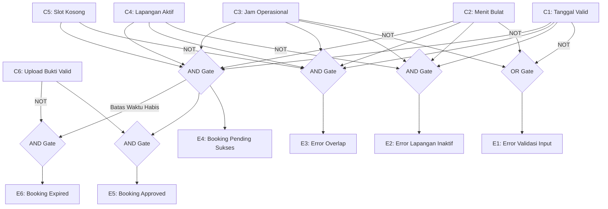

# Cause-Effect Relationship Testing - Fitur Pemesanan Lapangan

Dokumen ini mendokumentasikan analisis hubungan sebab-akibat (*Cause-Effect Graphing/Relationship*) untuk memvalidasi masukan logika bisnis pada metode `store` di [BookingController.php](file:///c:/xampp/htdocs/WebsiteBookingLapangan/app/Http/Controllers/BookingController.php).

---

## 1. Definisi Sebab (Causes) & Akibat (Effects)

### Sebab (Causes - Input Conditions):
*   **C1:** `booking_date` $\ge$ hari ini.
*   **C2:** Menit `start_time` & `end_time` bernilai `:00` (kelipatan jam genap).
*   **C3:** Jam sewa di dalam operasional (`07:00` s.d `22:00`).
*   **C4:** Lapangan berstatus aktif (`status == 'active'`).
*   **C5:** Slot waktu kosong (tidak bentrok / overlap = false).
*   **C6:** Pengguna mengunggah bukti transfer nominal valid dalam batas waktu 1 jam.

### Akibat (Effects - System Outputs):
*   **E1:** Menampilkan pesan kesalahan validasi input (Tanggal/Menit/Jam).
*   **E2:** Menampilkan pesan kesalahan "Lapangan sedang tidak aktif".
*   **E3:** Menampilkan pesan kesalahan "Slot waktu sudah dipesan".
*   **E4:** Pemesanan berhasil dibuat dengan status `pending` (total harga terhitung).
*   **E5:** Status pemesanan diubah menjadi `approved` (jadwal resmi dikunci).
*   **E6:** Status pemesanan otomatis menjadi `expired` (slot waktu dibebaskan).

---

## 2. Aturan Logika (Logical Relationships)

Hubungan sebab-akibat digambarkan dengan notasi logika boolean:

*   **Ekspresi E1 (Error Validasi Input):**
    $$E1 = \neg C1 \lor \neg C2 \lor \neg C3$$
    *(Jika tanggal lampau, ATAU menit ganjil, ATAU di luar jam operasional, maka tampilkan error validasi)*
*   **Ekspresi E2 (Error Lapangan Inaktif):**
    $$E2 = C1 \land C2 \land C3 \land \neg C4$$
    *(Jika input valid tetapi lapangan dalam perawatan, tampilkan error status lapangan)*
*   **Ekspresi E3 (Error Overlap):**
    $$E3 = C1 \land C2 \land C3 \land C4 \land \neg C5$$
    *(Jika input & lapangan valid tetapi slot waktu bentrok, tampilkan error jadwal)*
*   **Ekspresi E4 (Pemesanan Pending Sukses):**
    $$E4 = C1 \land C2 \land C3 \land C4 \land C5$$
    *(Jika seluruh input, status lapangan, dan ketersediaan slot terpenuhi, buat booking pending)*
*   **Ekspresi E5 (Pemesanan Approved):**
    $$E5 = E4 \land C6$$
    *(Jika booking pending berhasil dibuat DAN bukti pembayaran valid terunggah)*
*   **Ekspresi E6 (Pemesanan Expired):**
    $$E6 = E4 \land \neg C6 \text{ (setelah 1 jam)}$$
    *(Jika booking pending berhasil dibuat tetapi tidak ada pembayaran dalam 1 jam)*

---

## 3. Diagram Alir Logika Hubungan (Mermaid)

